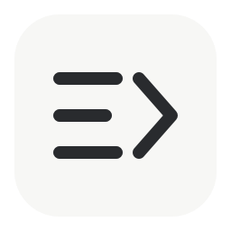
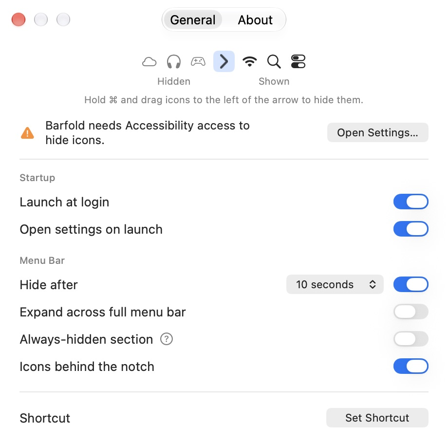

<p align="center">
  
</p>
<h1 align="center">Barfold</h1>
<p align="center">A little more room in your menu bar.</p>

**Barfold is an independent fork of [Hidden Bar](https://github.com/dwarvesf/hidden), created by Dwarves Foundation and its contributors.** It preserves their menu-bar hiding engine and source history, with refined native settings, clearer Accessibility setup, and a distinct visual identity.

<p align="center">
  
</p>

### What changed

- Compact native settings with a centered, balanced General / About control.
- Consistent rows, aligned switches, and a concise menu-bar placement guide.
- Accessibility onboarding that explains why hiding is unavailable and recovers when permission changes.
- Shortcut recording that cancels cleanly on Escape, tab changes, window close, or loss of focus.
- A simple new icon, with editable vector sources in [brand](brand).

The macOS 27 native hiding engine comes from upstream Hidden Bar ([#403](https://github.com/dwarvesf/hidden/pull/403)). The functional fixes and settings improvements are proposed upstream in [#433](https://github.com/dwarvesf/hidden/pull/433). Barfold’s name and logo stay in this fork.

### Build and run

Requires macOS 13 or later and Xcode. Build with Xcode 27 to include the newest native tab styling; the project also builds with older supported SDKs.

```sh
git clone https://github.com/richarddemann/barfold.git
cd barfold
./script/build_and_run.sh
```

To install locally:

```sh
./script/build_and_run.sh --install
```

The script creates an ad-hoc signed `Barfold.app`, backs up an existing Barfold installation, and installs it in `/Applications`. The Xcode project and scheme retain their upstream **Hidden Bar** names.

Barfold currently shares Hidden Bar’s bundle identifier so existing settings carry over. **Run one copy at a time.** The scripts stop either app before launching Barfold; an existing Hidden Bar installation is kept intact.

### Use it

Hold **⌘** and drag menu-bar icons to the hidden side, then click the arrow to show or hide them. On macOS 27, the arrow marks the boundary; earlier versions use a separator. Option-click the arrow to toggle the always-hidden section. Right-click for the context menu and notch-overflow access.

On macOS 27, allow the installed app under **System Settings → Privacy & Security → Accessibility** (called Device Control and Data Access on some versions). Settings explains when access is missing.

Ad-hoc signing ties approval to a specific build. Finish installing before authorizing the app. If an old entry remains enabled but Barfold still reports missing access, remove that entry and add `/Applications/Barfold.app` again.

### Checks and limitations

```sh
./script/test.sh
```

The suite covers menu-bar layout decisions, engine state changes, shortcut validation, and settings behavior. See the [build and verification guide](docs/RUNBOOK.md) for live checks.

On macOS 27, the direct build uses a private system visibility API. Hiding is per app, and system items remain visible. The sandboxed App Store build cannot use this engine. External-display behavior still needs a visual hardware check.

This repository publishes source, **not a notarized app release**. Homebrew’s `hiddenbar` cask installs the original Hidden Bar, not Barfold.

### Credits and license

Original app: **Hidden Bar**, by **Dwarves Foundation and contributors**. Barfold retains the original commit history and copyright notices and is distributed under the [MIT license](LICENSE). It is independently maintained and is not an official Dwarves Foundation release.

[Report an issue](https://github.com/richarddemann/barfold/issues) · [Original project](https://github.com/dwarvesf/hidden) · [Upstream contribution](https://github.com/dwarvesf/hidden/pull/433)
